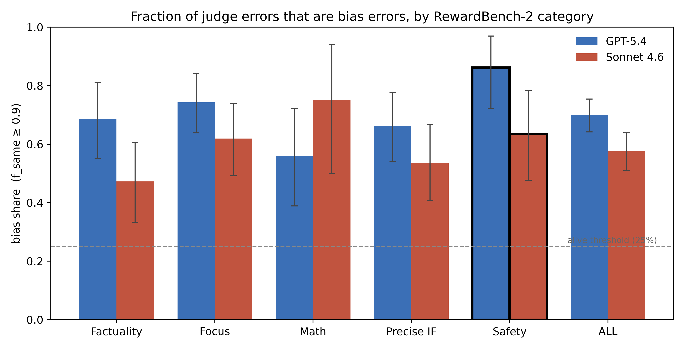
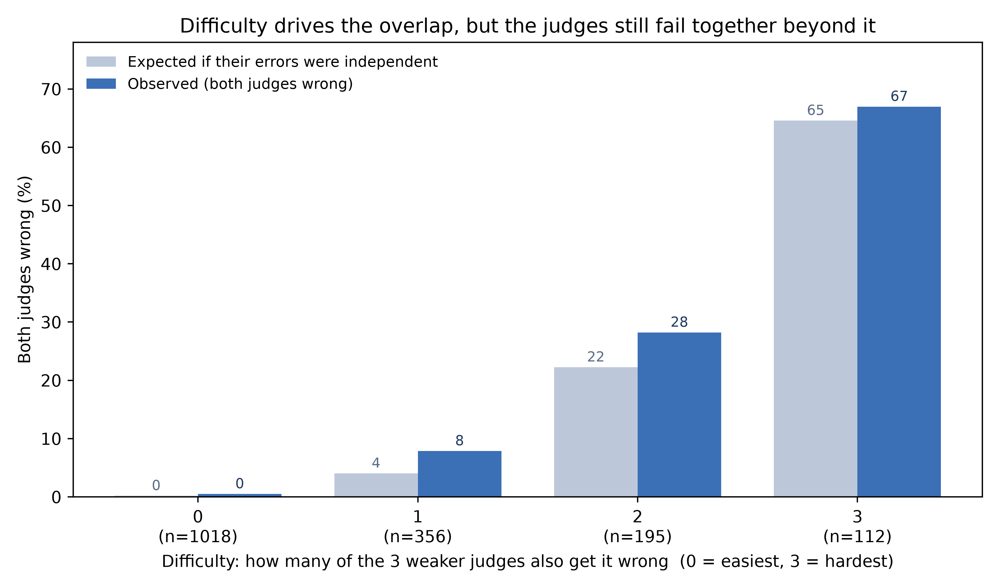
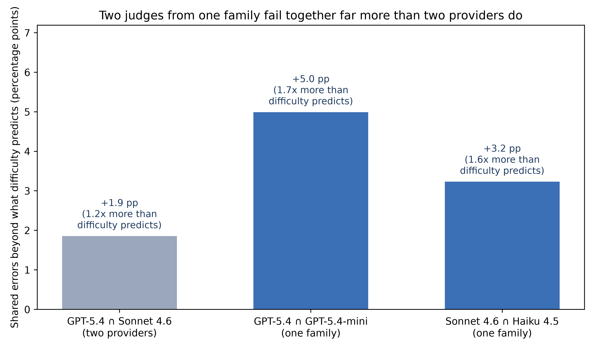

# does the judge know?

**When an LLM judge is wrong, does its own resample disagreement know?** A study
of LLM-judge error structure on RewardBench 2, and what it means for using
disagreement (resampling one judge, or polling a panel) as an error detector.

The writeup is in [`post/post.md`](post/post.md) (self-contained with its figures).

---

## The finding

When you score a response with an LLM judge several times, the scores wobble. A
natural hope is that this wobble is a smoke detector: when the judge is about to
be wrong, it disagrees with itself. On RewardBench 2, mostly it does not.

- **Most judge errors are stable, not noisy.** Resampling each judge 8× and
  bootstrapping the winner, **70% of GPT-5.4's errors** are *bias errors* — the
  judge picks the same wrong answer every time. On Safety it is **86%**. Sonnet
  4.6 is 58% / 63%.
- **That puts a hard ceiling on disagreement-based detection.** Disagreement can
  only ever catch the *unstable* errors, so the best achievable recall is about
  **30% of GPT-5.4's errors overall, ~14% on Safety** — and that is an upper
  bound, not an achieved number. The published "variance predicts incorrectness"
  signal (AUC ≈ 0.60) is weak not because it is poorly tuned but because, for
  most errors, there is nothing in the disagreement to detect.
- **The errors are shared across judges.** Two judges from *different providers*
  fail on the same inputs ~1.2× more than difficulty alone predicts; two judges
  from the *same model family* fail together **1.6–1.7×** more (difficulty
  controlled). A panel or a cheap-monitor→escalate pipeline buys fewer
  independent checks than its size suggests, and least of all within a family.

The safety reading: disagreement-based monitoring gives the most reassurance on
exactly the confidently-wrong inputs an adversary would steer toward.

## Results at a glance

The three figures used in the post (re-exported at 2× by `src.export_figures`):



*Fraction of each judge's errors that are bias errors, by RewardBench 2 category.
The recall ceiling of any disagreement detector is one minus the bar height.*



*Two frontier judges (GPT-5.4, Sonnet 4.6) are wrong together more often than
independence predicts, within every difficulty band — shared bias beyond
difficulty.*



*The same difficulty-adjusted overlap for three pairs: two judges from one family
overlap far more than two from different providers.*

## Repository layout

```
data/raw/        vendored RewardBench-2 judge-score collections (read-only)
data/            PROVENANCE.txt, tables/all_metrics.json (parity reference)
src/             one module per analysis step (see "What each module does")
results/         CSVs + markdown summaries; final_numbers.md indexes every post number
figures/         the 3 post figures (+ 2 supplementary escalation figures)
tests/           loader + winner/paper-parity tests
scripts/         fetch_data.sh — (re)vendor the pinned data snapshot
post/            the writeup + the three figures it embeds (self-contained)
```

## Reproduce

```sh
uv sync                              # create the env (numpy, pandas, scipy; matplotlib for figures)
bash scripts/fetch_data.sh           # optional: re-vendor data/raw/ from the pinned commit (already committed)

uv run python -m src.step0_audit         # data audit + acceptance gate
uv run python -m src.day1_analysis_a     # Analysis A: bias share  (+ fig1)
uv run python -m src.day1_analysis_b     # Analysis B: cross-judge overlap
uv run python -m src.day3_robustness     # robustness checks
uv run python -m src.day3c_escalation    # Analysis C: cheap-monitor escalation
uv run python -m src.day3d_cross_family  # Analysis D: cross-family escalation
uv run python -m src.export_figures      # re-render the 3 post figures at 2×

uv run pytest                            # loader + paper-parity tests
```

Everything is deterministic (seed 42). The analyses do no new model calls — they
reuse the vendored k=8 scores.

## What each module does

The `day1` / `day3` prefixes mark the order the investigation ran (Step 0 → Day 1
→ Day 3), which mirrors the post's structure.

| Module | Role |
|---|---|
| `data_loader.py` | Canonical loader. Flattens the nested raw JSONL into one long DataFrame; resolves judge identity from (file, score-key); keys examples on the compound `(category, example_id)`. **Read this first.** |
| `winners.py` | Winner / error / tie classification (paper protocol), the `f_same` winner-stability bootstrap (the bias/variance discriminant), and the rank-based variance-AUC. |
| `step0_audit.py` | Inventories the data, runs structural sanity checks, evaluates the ≥1,600-common-example acceptance gate. |
| `day1_analysis_a.py` | **Analysis A** — within-judge bias share + recall ceiling per category; renders `fig1`. |
| `day1_analysis_b.py` | **Analysis B** — cross-judge error overlap: `build_common` (the shared frame), difficulty-adjusted excess, Mantel–Haenszel odds ratio, permutation control. Reused by the post-figure scripts and Analyses C/D. |
| `day3_robustness.py` | Six robustness checks (criteria injection, `f_same` thresholds, ties in/out, difficulty proxy, the tier judges, the capability gradient). |
| `day3c_escalation.py` | **Analysis C** — cheap-monitor→escalate: shared bias across same-family tiers, and how weakly the monitor's uncertainty flags the frontier judge's errors. |
| `day3d_cross_family.py` | **Analysis D** — simulates the escalation *system* to ask whether a cross-family backstop beats a same-family one (it is not a robust win). |
| `post_fig_overlap.py` | Post figure: per-difficulty cross-judge overlap (`fig2_cross_judge_overlap`). |
| `post_fig_family.py` | Post figure: same-family vs cross-provider overlap (`fig_family_overlap`). |
| `export_figures.py` | Re-renders the three post figures at 2× resolution. |

Analyses C and D also write two **supplementary** figures (`fig_escalation_recall`,
`fig_escalation_family`) that are *not* used in the post.

## Key definitions

- **Bias error vs variance error.** An *error* is the judge giving its highest
  mean score to a wrong response (ties count as not-correct, per the benchmark).
  Bootstrap-resample each response's k=8 samples and recompute the winner B
  times; `f_same` is the fraction of resamples that reproduce the observed
  winner. A non-tie error with **`f_same ≥ 0.9`** is a *bias error* (stably
  wrong); the rest are *variance errors* (resampling sometimes fixes them).
- **Bias share** = bias errors ÷ non-tie errors. **Recall ceiling** = 1 − bias
  share: the most any resample-based detector could catch at useful precision.
- **Difficulty-adjusted overlap.** For a pair of judges, the rate at which both
  are wrong on the same example, compared with the rate expected if they failed
  independently *within each difficulty band*. Difficulty is the number of
  *other* judges (outside the pair) that also err, so the control cannot absorb
  the shared bias being measured.

## Data

Reuses the paired k=8 judge-score collections from
[`composo-ai/llm-judge-criteria-ensembling`](https://github.com/composo-ai/llm-judge-criteria-ensembling),
vendored read-only under `data/raw/` and pinned to commit `e4049a5` (see
`data/PROVENANCE.txt`). RewardBench 2, five subsets (Factuality, Focus, Math,
Precise IF, Safety), four responses per example (response 0 is correct), eight
score samples per response. Judges: GPT-5.4 / -mini / -nano and Sonnet 4.6 /
Haiku 4.5, under a base and a criteria-injection prompt.

`data/tables/all_metrics.json` is an earlier upstream metrics snapshot (~40 fewer
usable examples), kept only as the parity reference for the winner-logic test;
Factuality accuracy reproduces bit-exactly and the variance-AUC reproduces the
paper's ≈0.60.

## Limits

One benchmark, two providers plus their tiers, prompted MCQ-style judges, k=8. No
adversarial optimisation (a named follow-up). The Safety slices of the overlap
and escalation analyses are underpowered (~30–40 errors), and the cross-judge
overlap is a conservative lower bound. See the post's "Limits" section. This
study extends the same data used in our ICML workshop paper with a sharper lens.
